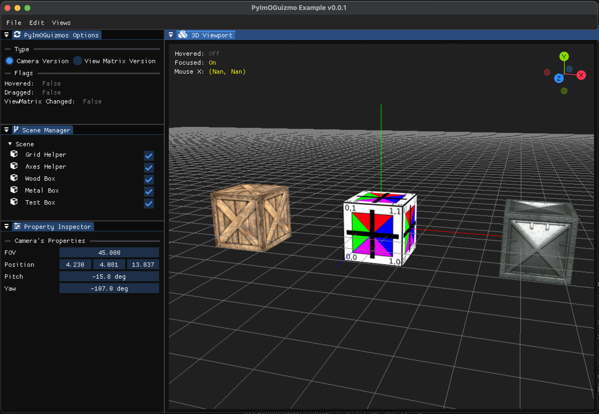

# PyImoGuizmo

### An Interactive Orientation Gizmo for ImGui in Python

> ⚠️ Warning: This Library is still a Work In Progress 🚧 👷 ‼️


### Overview

PyImoGuizmo is a Python library mostly ported from the C++ [ImOGuizmo](https://github.com/fknfilewalker/imoguizmo) library. It provides an interactive orientation gizmo for the 3D Viewport  within ImGui-based applications, such as those using [imgui_bundle](https://github.com/pthom/imgui_bundle).


Designed for **simplicity** and **ease of integration** with your ImGui-based applications, PyImoGuizmo leverages PyGLM for efficient matrix operations and transformations.


### ✨ Features

- Interactive orientation gizmo for 3D transformations
- Configurable colors, axis length, and other properties [🚧 WiP]
- Seamless integration with ImGui in Python
- Powered by PyGLM for high-performance matrix calculations
- Supports both left-handed and right-handed coordinate systems [🚧 WiP]

### 📥 Installation

Currently, you can install **PyImoGuizmo** by:

* Downloading the `PyImoGuizmo.py` file directly
* Cloning this repository
```sh
git clone https://github.com/tingspain/PyImOGuizmo.git
cd PyImOGuizmo
```

A PyPI release is planned once the library reaches a more stable and mature state.


### 🚀 Usage

Here’s a basic example of how to integrate **PyImoGuizmo** into your project:

```Python
from imgui_bundle import imgui
import PyImOGuizmo 


# Create a Camera
viewport_camera = PyImOGuizmo.Camera( viewport_width/viewport_height, 
                                        position = (0, 1, 15), 
                                        pitch    = 0, 
                                        yaw      = -90) 

# Set Rotation Sensitivity per axis of rotation
PyImOGuizmo.config.yaw_rotation_speed   = 0.25 
PyImOGuizmo.config.pitch_rotation_speed = 0.25 


# Pass the draw list of the current window to the PyImOGuizmo
PyImOGuizmo.set_draw_list()

# Set the location of the Gizmo
PyImOGuizmo.set_rect( rect_max.x - 120, 
                      rect_min.y, 
                      80)

# Draw the Gizmo
is_view_changed, is_gizmo_hovered, is_gizmo_dragged = PyImOGuizmo.draw_gizmo_camera(viewport_camera)


```

### 📌 Notes

There are currently two ways to use PyImoGuizmo:

1. `draw_gizmo_camera()` → Requires a PyImOGuizmo Camera (or any object with the necessary attributes).
2. `draw_gizmo()` → Requires the camera's view matrix to be passed manually. (This method is still under development and may not work 100% correctly.)


### 🛠 Example

The provided example app demonstrates how to use PyImoGuizmo to control the camera of a 3D viewport. Additionally, it showcases how to integrate ModernGL with imgui_bundle for real-time rendering and GUI interaction.



#### 📦 Dependencies

To run the example, the following dependencies are required:

- imgui_bundle – For GUI rendering
- moderngl – For OpenGL rendering
- pyglm – For matrix operations and transformations

This project is managed using [UV](https://github.com/astral-sh/uv), a modern Python package manager.

#### 🚀 Running the Example

Follow these steps to run the example application:

1. Clone the PyImOGuizmo repository
```sh
git clone https://github.com/tingspain/PyImOGuizmo.git
cd PyImOGuizmo
```

2. Install UV (if not already installed)
```sh 
pip install uv
```

3. Navigate to the example folder
```sh
cd examples
```

4. Run the application
```sh 
uv run main.py
```

This will launch the example app, allowing you to interact with PyImoGuizmo in a 3D viewport.

### 🛣️ Roadmap

PyImoGuizmo is still under active development. Below are key milestones planned for future releases:

- 🚀 Planned Features & Improvements
- ✅ Initial implementation – Interactive orientation gizmo with basic functionality (Completed)
- 🔄 Improve draw_gizmo() method – Ensure it works 100% correctly
- 🎨 Customizable appearance – Add more flexibility for colors, size, and styles
- 🔧 API improvements – Refactor code for better usability and extensibility
- 📦 PyPI release – Package and publish the library for easier installation
- 📖 Documentation & Examples – Provide clear usage guides and sample projects
- 🏗️ Additional features – TBD based on community feedback

If you have any suggestions or feature requests, feel free to open an issue or contribute!

### 📜 License

PyImoGuizmo is licensed under the MIT License.

``` license 
MIT License  

Copyright (c) 2025 JuanMa Romero Martin  

Permission is hereby granted, free of charge, to any person obtaining a copy  
of this software and associated documentation files (the "Software"), to deal  
in the Software without restriction, including without limitation the rights  
to use, copy, modify, merge, publish, distribute, sublicense, and/or sell  
copies of the Software, and to permit persons to whom the Software is  
furnished to do so, subject to the following conditions:  

The above copyright notice and this permission notice shall be included in all
copies or substantial portions of the Software.

THE SOFTWARE IS PROVIDED "AS IS", WITHOUT WARRANTY OF ANY KIND, EXPRESS OR
IMPLIED, INCLUDING BUT NOT LIMITED TO THE WARRANTIES OF MERCHANTABILITY,
FITNESS FOR A PARTICULAR PURPOSE AND NONINFRINGEMENT. IN NO EVENT SHALL THE
AUTHORS OR COPYRIGHT HOLDERS BE LIABLE FOR ANY CLAIM, DAMAGES OR OTHER
LIABILITY, WHETHER IN AN ACTION OF CONTRACT, TORT OR OTHERWISE, ARISING FROM,
OUT OF OR IN CONNECTION WITH THE SOFTWARE OR THE USE OR OTHER DEALINGS IN THE
SOFTWARE.
```

### Acknowledgment

This project is partially ported from [**ImOGuizmo**](https://github.com/fknfilewalker/imoguizmo/tree/main), which is also licensed under the MIT License.

For full license details, see the [LICENSE](https://github.com/fknfilewalker/imoguizmo/blob/main/LICENSE) file in this repository.
